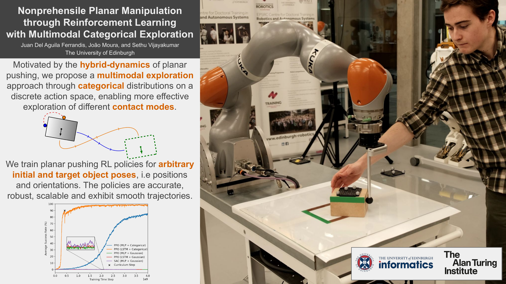

# Nonprehensile Planar Manipulation through Reinforcement Learning with Multimodal Categorical Exploration

Authors: Juan Del Aguila Ferrandis, João Moura, and Sethu Vijayakumar.

[Paper](https://arxiv.org/abs/2308.02459) | [Video](https://www.youtube.com/watch?v=vTdva1mgrk4) | [Presentation](https://www.youtube.com/watch?v=F5RZfdZUCis)

2023 IEEE/RSJ International Conference on Intelligent Robots and Systems (IROS 2023)


<p align="center">
  
</p>

## Repository Structure

* `pushing_envs`: contains the Gym environments for planar pushing, where the physics simulations are performed using PyBullet.
* `rl_policies`: contains the scripts for training the Reinforcement Learning policies. For example, `ppo_lstm_categorical` contains the script `train.py` to train a PPO policy, with an LSTM architecture for the policy and value functions, and categorical exploration. Note that we experienced an issue where sometimes the training would crash due to excessive RAM usage. We provide the script `continue_training.py` to continue the training process from the last available checkpoint.  
* `run_policies`: contains a sample trained PPO (LSTM + Categorical) policy and a script `run.py` for running and visualizing the policy in simulation. 
* `requirements.txt`: contains the dependencies required to train and run the policies.

## Usage

Train a PPO (LSTM + Categorical) policy with:

```
python3 -m pushing-multimodal.rl_policies.ppo_lstm_categorical.train
```

Visualize the provided trained PPO (LSTM + Categorical) policy in simulation with:

```
python3 -m pushing-multimodal.run_policies.run
```

## Reference

If you find this project useful, please cite our paper as:

```
@inproceedings{delaguila2023nonprehensile,
    author={Juan {Del Aguila Ferrandis} and Jo{\~a}o Moura and Sethu Vijayakumar},  
    booktitle={IEEE/RSJ International Conference on Intelligent Robots and Systems (IROS)},   
    title={Nonprehensile Planar Manipulation through Reinforcement Learning with Multimodal Categorical Exploration},   
    year={2023}
}
```


